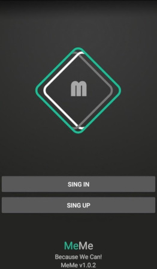
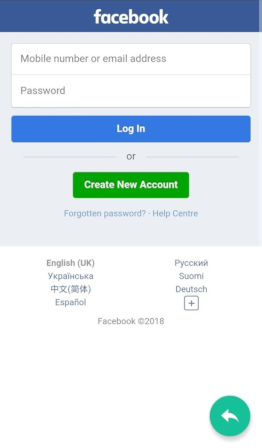

# MeMe (Merged Messenger) or Social Portal

Project itself has long story started in 2018. Once an idea was born to combine message transferring
between popular chats, social networks. Users could chat between each other by sending text, media for
example from Facebook to LinkedIn and vice versa.

My interest was born immediately since I was curios about one detail: how social networks can
exchange data between each other in terms of 2 users at least. What if 1 user only FB account and
second one has LinkedIn !?

Occurred initiative was born to find answers on all questions above.

# Results
Fast answer - no. Social networks block their user base as much as possible due to security reasons.

# Consequences
Nevertheless all initiative was failed a PoC was created anyway. Currently it supports next channels:
- Facebook
- Telegram
- Vkontakte
- Instagram
- YouTube
- Twitch
- Skype
- Twitter
- Tumblr
- Pinterest
- Slack
- Linked in
- Odnoklassniki
- Discord
- GaduGadu
- ICQ
- Gmail
- MailRu
- Reddit
- Quora
- Stackoverflow
- Habr

Currently it reminds some sort of social portal rather than merged messenger.
User auth process is based on Google FireBase API.

## Dev environment specification
Next tools were used to develop PoC: 
#Android SDK: API 21: Android 5.0 (Lollipop) - 71.3% coverage of devices for 2018-2019 
#IDE: Android Studio v3.0.1 
#JDK: openJDK v8.0 
#Auth: FireBase 
#Build tool: Gradle v3.0 

## Founders
Oleksandr Kuzmin, Andrey Stoyanov

## License
MIT

## Links
Download and check application: https://play.google.com/store/apps/details?id=com.spandr.meme&hl=en_US